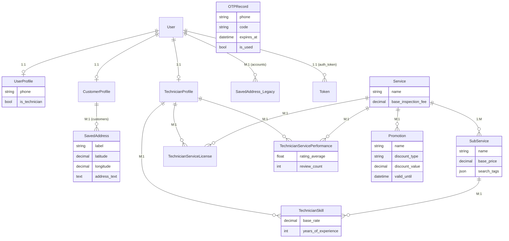

# Backend Entity Relationship Diagram (ERD)

This diagram represents the core entities and their relationships in the Django backend.

## Key Architectural Notes

1.  **User Roles**: The system uses a "One-to-One Profile" pattern. Every `User` can have a `UserProfile` (basic info), a `CustomerProfile` (role-specific), and/or a `TechnicianProfile` (role-specific).
2.  **Service Catalog**: 
    - `Service` is the top-level category (e.g., Plumbing).
    - `SubService` is the specific task (e.g., Leak Repair).
3.  **Technician Skills**: Technicians link to `SubServices` via the `TechnicianSkill` junction table, which allows them to set their own rates per skill.
4.  **Performance & Trust**: 
    - `TechnicianServicePerformance` tracks metrics per service for matchmaking.
    - `TechnicianServiceLicense` stores verification documents.
5.  **Redundancy Check**: Note that `SavedAddress` exists in both `accounts` and `customers`. Based on the models, `customers.SavedAddress` is linked to `CustomerProfile`, while `accounts.SavedAddress` is linked directly to `User`.
