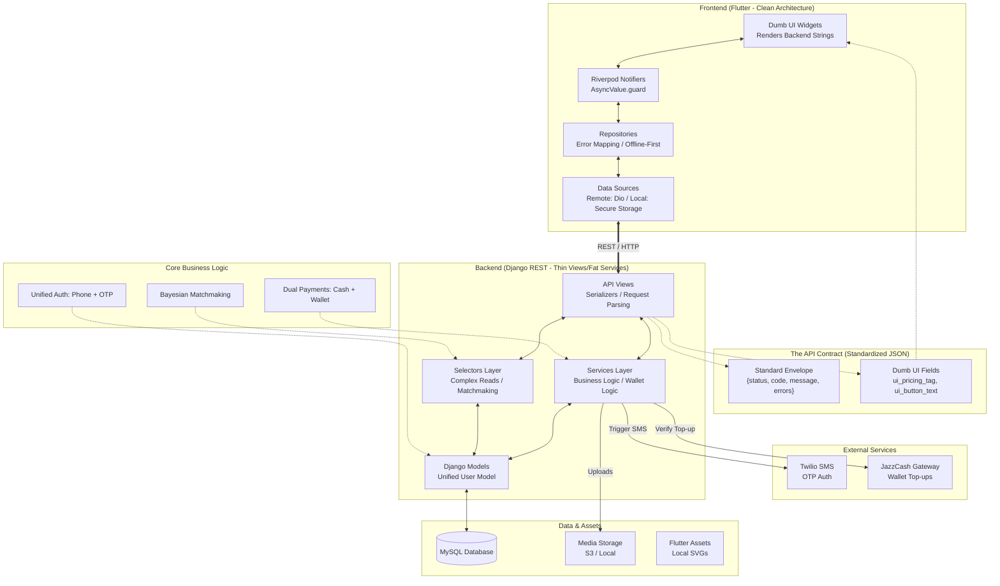
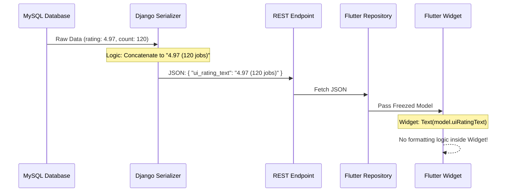

# Master System Architecture

This is the definitive guide to the Home Services Marketplace architecture, combining high-level flows with granular implementation patterns.

---

## 1. The Master Blueprint
This diagram shows how the Frontend, Backend, and External Services are interconnected.

---

## 2. Functional Patterns (The "Moving Parts")

### A. The "Dumb UI" Sequence
The Backend decides the UI state; the Frontend simply renders strings.

### B. Unified Auth & Routing Matrix
The **Verify OTP API** flags dictate the Flutter app's navigation path.

| `new_user` | `name_required` | `is_technician` | Destination Screen |
| :--- | :--- | :--- | :--- |
| `true` | `true` | `false` | Complete Profile Screen |
| `false` | `true` | `-` | Complete Profile (Incomplete Account) |
| `false` | `false` | `false` | Customer Home Screen |
| `false` | `false` | `true` | Technician Home Screen |

### C. The 4-Layer Error Pipeline
Ensures type-safe, user-friendly errors across the monorepo.

1.  **Django API**: Returns standard JSON Envelope (`400/401/500`).
2.  **RemoteDataSource**: Parses JSON and throws `HttpFailure`.
3.  **Repository**: Maps `HttpFailure.code` to a **Domain Sealed Class Failure**.
4.  **UI/Notifier**: Pattern matches the failure using `switch` to show a Snackbar.

---

## 3. Engineering & Security Mandates

*   **Concurrency**: Wallet operations and job status changes use `transaction.atomic()` + `select_for_update()` in the **Services Layer**.
*   **IDOR**: All Selectors and Services are scoped to `request.user` to prevent unauthorized data access.
*   **Offline-First**: Every read operation in Flutter follows: `Remote Fetch` → `Update Local Cache` → `Fallback to Local on Network Failure`.
*   **Matchmaking**: Uses a **Bayesian Average** (Trust Constant $m=10$) and **Haversine Distance** to prioritize technicians.

---

## 4. Documentation Index (Source of Truth)
For exact JSON schemas, refer to the feature-specific contracts:
*   **Authentication**: `backend/accounts/api/AUTH_API.md`
*   **Service Discovery**: `backend/customers/api/DISCOVERY_API.md`
*   **Search & Catalog**: `backend/catalog/api/SEARCH_API.md`
*   **Technician Onboarding**: `backend/technicians/api/ONBOARDING_API.md`
